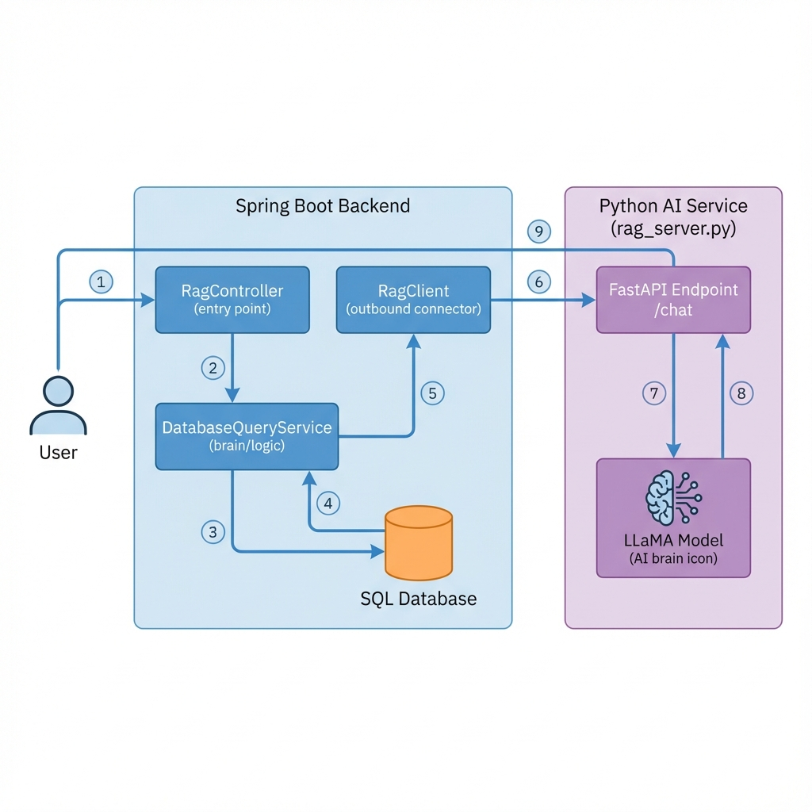

# Backend RAG Data Flow Architecture

This document outlines the architecture and data flow for the RAG (Retrieval-Augmented Generation) system, specifically focusing on the integration between the Spring Boot Backend and the Python AI Service.

## Global Architecture Schema

The system uses a **Push-based RAG approach** where the backend pre-fetches relevant context from its own relational database and "pushes" it to the AI service, rather than the AI service retrieving data independently.



## Detailed Data Flow Explanation

The process follows a strictly orchestrated flow where the Spring Boot application acts as the "Controller" of information.

### 1. Request Handling (Spring Boot)
*   **EntryPoint**: The user sends a request to the `RagController` (`/api/rag/chat`).
*   **Authentication**: The controller first verifies the user's identity (Pharmacist, Supplier, or Generic User) via Spring Security.

### 2. Context Aggregation (`DatabaseQueryService`)
Instead of generic retrieval, the system builds a highly specific context based on the user's role and query intent.
*   **Intent Detection**: The service analyzes the user's prompt using keyword matching (e.g., "stock", "commande", "alerte") to decide what data is relevant.
*   **Role-Based Data Fetching**:
    *   **Pharmacist**: Fetches their specific stock, recent orders, and alerts from the `SQL Database` using standard Repositories (`MedicamentRepository`, `CommandeRepository`, etc.).
    *   **Supplier**: Fetches purely the products they supply and their related order history.
*   **Formatting**: The raw database entities are converted into human-readable strings (e.g., `"Medicament: Doliprane | Quantite: 50"`).

### 3. AI Interaction (`RagClient`)
*   The `RagClient` bundles the user's original prompt along with this curated list of strings into a single JSON payload.
*   It sends this payload to the Python service via HTTP POST.
*   **Key Field**: `external_context`. This field carries the real-time database data.

### 4. Generation (Python Service)
*   The `rag_server.py` receives the request.
*   **Constraint Checking**: It checks for the presence of `external_context`.
*   **Bypass**: Since `external_context` is provided, the Python server **skips internal retrieval** (like S3/Vector DB). It assumes the backend has provided all necessary information.
*   **Prompt Engineering**: It constructs a system prompt that includes the injected context and instructs the LLaMA model to answer based *only* on that provided information.
*   **Inference**: The LLaMA model generates a natural language response.

### 5. Response Delivery
*   The generated text is returned to the Spring Boot Client.
*   The Spring Boot Controller relays the final answer to the user.

---

## Où est le Machine Learning ?

Le ML est **entièrement dans `rag_server.py`** (service Python). Trois composants sont utilisés, mais **pas tous pour chaque source de données** :

### ML par Source de Données

| Source | Sentence Transformers | FAISS | LLaMA 3.2 |
|--------|:---------------------:|:-----:|:---------:|
| **S3 (CSV)** | ✅ Embeddings | ✅ Retrieval | ✅ Génération |
| **Spring Boot** | ❌ Bypassé | ❌ Bypassé | ✅ Génération |

---

### Flux S3 (Retrieval complet)
```
Question → [Sentence Transformer] → [FAISS Search] → Top-K Chunks → [LLaMA] → Réponse
```
- **Embeddings** : Convertit la question en vecteur (`all-MiniLM-L6-v2`)
- **FAISS** : Trouve les chunks similaires dans le CSV indexé
- **LLaMA** : Génère la réponse à partir du contexte récupéré

---

### Flux Spring Boot (Génération uniquement)
```
Question + Contexte SQL → [LLaMA] → Réponse
```
- Le backend envoie `external_context` (données SQL pré-formatées)
- **Embeddings/FAISS sont bypassés** (pas de recherche nécessaire)
- **LLaMA génère** la réponse à partir du contexte fourni

---

### Composants ML

| Composant | Modèle | Rôle |
|-----------|--------|------|
| **LLM** | `meta-llama/Llama-3.2-3B-Instruct` | Génération de texte (toujours actif) |
| **Embeddings** | `sentence-transformers/all-MiniLM-L6-v2` | Vectorisation (S3 uniquement) |
| **Vector Search** | FAISS (`IndexFlatL2`) | Recherche par similarité (S3 uniquement) |

> [!NOTE]
> Le backend Spring Boot ne contient **aucun code ML**. Il collecte les données SQL et les transmet au service Python.

---

## Questions Supportées par le Chatbot

Le système RAG peut répondre aux questions basées sur le fichier CSV `medicaments_maroc.csv` contenant **5000+ médicaments marocains**.

### ✅ Questions avec Bonnes Réponses

#### 1. Maladies et Pathologies
| Question exemple | Données utilisées |
|------------------|-------------------|
| "Quel médicament pour le diabète de type 2 ?" | `Indication(s)` |
| "Traitement pour l'hypertension artérielle" | `Indication(s)`, `Classe thérapeutique` |
| "Médicament contre la polyarthrite rhumatoïde" | `Indication(s)` |
| "Traitement de l'ostéoporose" | `Indication(s)` |
| "Médicament pour l'asthme persistant" | `Indication(s)` |
| "Traitement du cancer de la prostate" | `Indication(s)` |
| "Médicament pour la schizophrénie" | `Indication(s)` |
| "Traitement de l'épilepsie" | `Indication(s)` |

#### 2. Infections
| Question exemple | Données utilisées |
|------------------|-------------------|
| "Antibiotique pour infection urinaire" | `Indication(s)`, `Classe thérapeutique` |
| "Traitement pour la pneumonie" | `Indication(s)` |
| "Médicament contre la sinusite bactérienne" | `Indication(s)` |
| "Antifongique pour candidose" | `Indication(s)`, `Composition` |
| "Antiviral pour le zona" | `Indication(s)` |
| "Traitement de l'otite moyenne" | `Indication(s)` |

#### 3. Allergies et Rhinites
| Question exemple | Données utilisées |
|------------------|-------------------|
| "Antihistaminique pour allergie" | `Classe thérapeutique` |
| "Traitement de la rhinite allergique" | `Indication(s)` |
| "Médicament contre l'urticaire chronique" | `Indication(s)` |
| "Traitement pour le rhume des foins" | `Indication(s)` |

#### 4. Douleurs et Inflammations
| Question exemple | Données utilisées |
|------------------|-------------------|
| "Anti-inflammatoire pour arthrose" | `Indication(s)`, `Classe thérapeutique` |
| "Antalgique pour douleurs post-opératoires" | `Indication(s)` |
| "Traitement des douleurs cancéreuses" | `Indication(s)` |
| "Médicament pour les contractures musculaires" | `Indication(s)` |

#### 5. Questions sur les Médicaments
| Question exemple | Données utilisées |
|------------------|-------------------|
| "Prix du Doliprane au Maroc" | `Nom`, `Prix (DHS)` |
| "Posologie de l'amoxicilline" | `Posologies et mode d'administration` |
| "Contre-indications du paracétamol" | `Contres-indication(s)` |
| "Composition de l'Augmentin" | `Composition` |
| "Quel est le générique de X ?" | `Princeps`, `Nom` |

#### 6. Questions Pédiatriques
| Question exemple | Données utilisées |
|------------------|-------------------|
| "Médicament pour enfant de 2 ans avec fièvre" | `Age minimal d'utilisation`, `Indication(s)` |
| "Sirop antibiotique pour enfant" | `Présentation`, `Age minimal` |
| "À partir de quel âge peut-on donner X ?" | `Age minimal d'utilisation` |

#### 7. Grossesse et Allaitement
| Question exemple | Données utilisées |
|------------------|-------------------|
| "Médicament autorisé pendant la grossesse" | `Grossesse` |
| "Peut-on prendre X pendant l'allaitement ?" | `Allaitement` |

---

### ⚠️ Questions avec Réponses Limitées

Ces questions en langage courant nécessitent une **traduction** vers les termes médicaux :

| Question grand public | Terme médical correspondant |
|-----------------------|-----------------------------|
| "J'ai mal à la tête" | Antalgique, Paracétamol, Céphalées |
| "Mon enfant a de la fièvre" | Antipyrétique, Paracétamol |
| "J'ai le nez bouché" | Décongestionnant, Rhinite |
| "Je tousse beaucoup" | Antitussif, Dextrométhorphane |
| "J'ai mal au ventre" | Antispasmodique, Antiacide |
| "Je n'arrive pas à dormir" | Hypnotique, Troubles du sommeil |

> [!TIP]
> Le prompt système de LLaMA a été configuré pour traduire automatiquement ces termes courants vers les termes médicaux du CSV.

---

### ❌ Questions Non Supportées

| Type de question | Raison |
|------------------|--------|
| "Quel est le meilleur médicament ?" | Jugement subjectif non présent dans les données |
| Diagnostic médical | Le système ne fait PAS de diagnostic |
| Interactions médicamenteuses | Données non présentes dans le CSV |
| Disponibilité en pharmacie | Données temps réel non disponibles |
